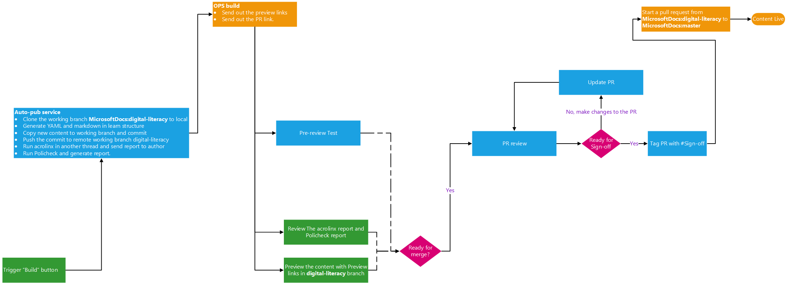

## Submit Learn build

Content author could trigger the learn build by clicking the **Go to Build** button in git repository. After the button is triggered, the auto-publishing tool will perform:
- Generate the Learn build, markdown, YAML, PNG, etc.
- Create a PR to the target working branch in MicrosoftDocs GitHub Account.
- Trigger OPS build and collect build information.
- Run Policheck and Acrolinx check.
- Send a build email to content author with following items:
    - Build preview links
    - Acrolinx score report
    - Policheck report

In the meanwhile, PDETs publishing team will receive the build email and perform the pre-review testing, focus on checking:
- Metadata fields format in all YAML files should confirm the Learn standard.
- Acrolinx report for all files should above 80.
- All embedded videos are hosted in RedTiger.
- Media files are store in same repository.
- Knowledge check should conform the Learn standard.
- Links should be valid.
- Links (docs, azure, technet, msdn links) should not include any language code.

## Ready for merge

After content author reviewed the content build and fixed all the bugs that PDETs team logged, that means the build is ready for merge, then PDETs publishing team would preform:
- Perform PR review check and log bugs.
- If all bugs are resolved, sign off the PR by tagging `#sign-off` in the PR comment.

## Sign-off
The PR review team would involve and review and merge to the working branch in MicrosoftDocs GitHub account.

