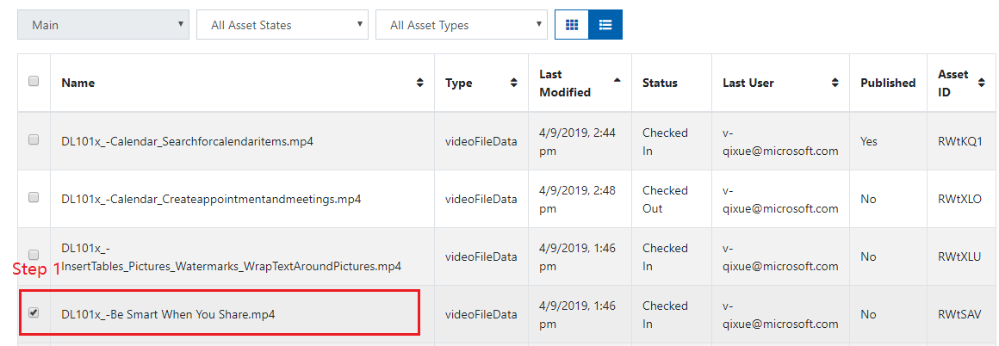
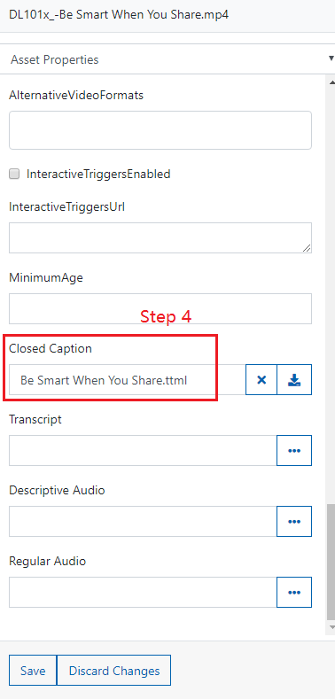
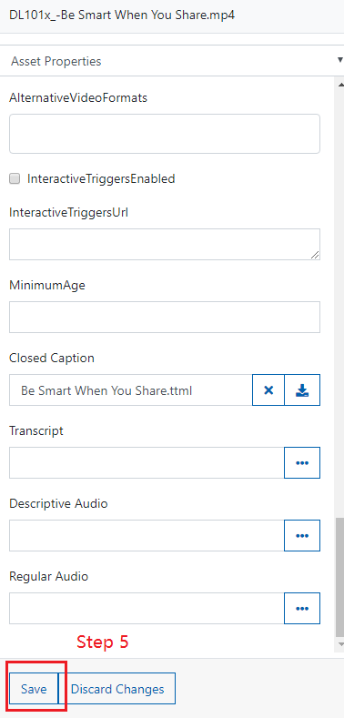
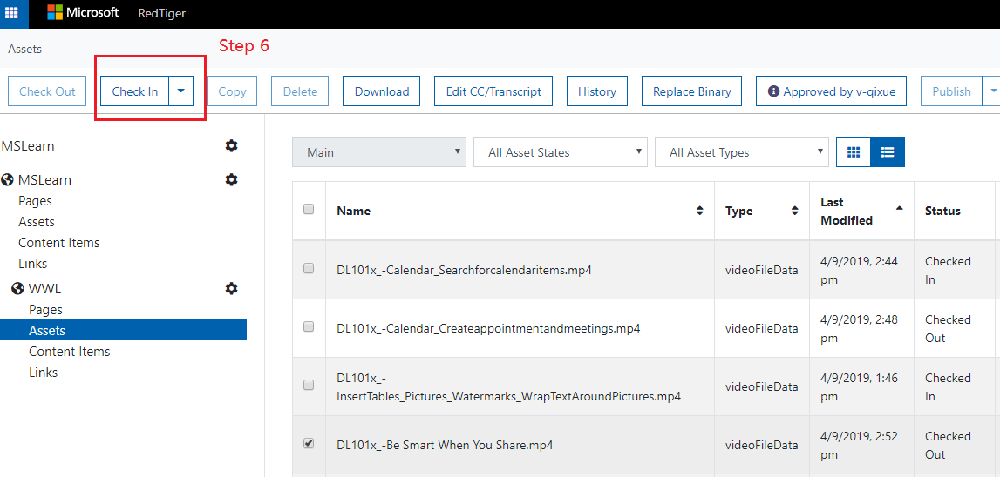
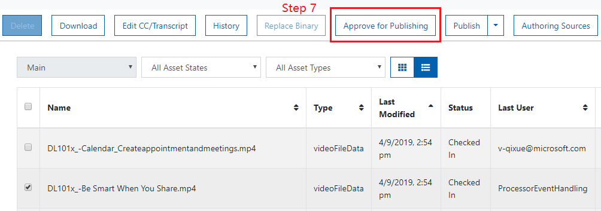
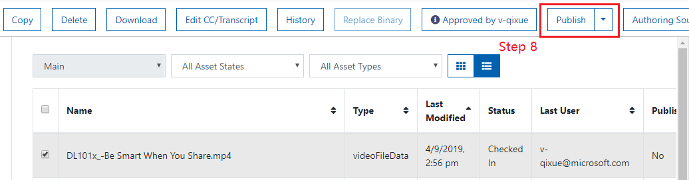
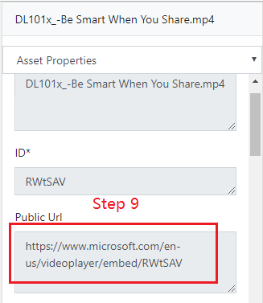

## Exercise

1. Select an asset (check the checkbox before the file name).

2. Check out the asset, click the **Check Out** button at top of the page.

3. In properties window, navigate to **Closed Caption**, click the **three dots (...)** to open file explorer.  

4. Select the .ttml file for the video.  

5. Click **Save** button to save the change.  

6. Check in the asset, click the **Check In** button at top of the page.

7. (User 1) Approve for Publishing, click the **Approve for Publishing** button at top of page.

8. (User 2) Publish, click the **Publish** button at top of page.

9. Get public Url, in properties window, navigate to **Public Url**, copy out the video url.   
